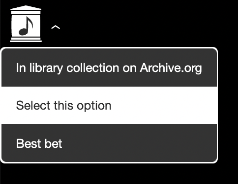

# `<ia-dropdown>` web component




## Usage
```js
const options = [{
  id: 'option-1',
  selectedHandler: (option) => alert(option.id),
  label: html`<p>Best option</p>`
}]

<ia-dropdown
  options=${options}
  displayCaret
  @optionSelected=${({ detail }) => console.log('changed', detail.option )}
>
  <p id="custom trigger" slot="dropdown-label">Click me to toggle options</p>
</ia-dropdown>
```
### CSS vars:

Primary:
- `var(--dropdownTextColor, #fff)`
- `var(--dropdownBgColor, #333)`
- `var(--dropdownCaretColor, #fff)`
- `var(--dropdownBorderColor, #fff)`

Selected:
- `var(--dropdownSelectedBgColor, #fff)`
- `var(--dropdownSelectedTextColor, #2c2c2c)`

Hover:
- `var(--dropdownHoverBgColor, #fff)`
- `var(--dropdownHoverTextColor, #2c2f2c)`
- `var(--dropdownHoverTopBottomBorderColor, #333)`


## Local Demo with `web-dev-server`
```bash
yarn start
```
To run a local development server that serves the basic demo located in `demo/index.html`

## Testing with Web Test Runner
To run the suite of Web Test Runner tests, run
```bash
yarn run test
```

To run the tests in watch mode (for &lt;abbr title=&#34;test driven development&#34;&gt;TDD&lt;/abbr&gt;, for example), run

```bash
yarn run test:watch
```

## Linting with ESLint, Prettier, and Types
To scan the project for linting errors, run
```bash
yarn run lint
```

You can lint with ESLint and Prettier individually as well
```bash
yarn run lint:eslint
```
```bash
yarn run lint:prettier
```

To automatically fix many linting errors, run
```bash
yarn run format
```

You can format using ESLint and Prettier individually as well
```bash
yarn run format:eslint
```
```bash
yarn run format:prettier
```

## Tooling configs

For most of the tools, the configuration is in the `package.json` to reduce the amount of files in your project.

If you customize the configuration a lot, you can consider moving them to individual files.
